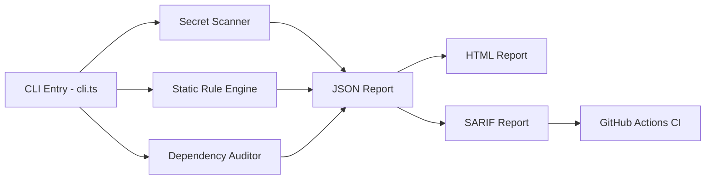

# 🔍 Analisis Mendalam: Peluang Menang HackOWASP 8.0

## Konteks Kompetisi

| Detail | Keterangan |
|---|---|
| **Event** | HackOWASP 8.0 — Flagship hackathon OWASP Thapar Student Chapter |
| **Durasi** | 36 jam (18-19 April 2026) |
| **Venue** | TIET Patiala, Punjab (offline) |
| **Tracks** | Cybersecurity, Web Dev, Blockchain, Emerging Tech |
| **Judging** | Technical Depth, Real-World Utility, Innovation |
| **Waktu tersisa** | ⚠️ Sangat terbatas — kompetisi berakhir 19 April 2026 |

---

## Project Overview: OWASP Guardrail

**Konsep:** CLI DevSecOps scanner yang mendeteksi risiko OWASP sebelum merge. Output dalam format JSON, HTML, dan SARIF.

### Arsitektur Saat Ini



### Fitur Yang Sudah Ada

| # | Fitur | Status | File |
|---|---|---|---|
| 1 | Secret scanning (GitHub tokens, private keys, JWT/API secrets) | ✅ Berjalan | `cli.ts:46-65` |
| 2 | High-entropy credential detection | ✅ Berjalan | `cli.ts:160-171` |
| 3 | Wildcard CORS detection | ✅ Berjalan | `cli.ts:179-189` |
| 4 | SQL injection pattern detection | ✅ Berjalan | `cli.ts:191-201` |
| 5 | Route without auth middleware detection | ✅ Berjalan | `cli.ts:203-213` |
| 6 | npm audit dependency scanning | ✅ Berjalan | `cli.ts:218-249` |
| 7 | JSON report output | ✅ Berjalan | `cli.ts:93` |
| 8 | HTML report (dark theme) | ✅ Berjalan | `cli.ts:345-393` |
| 9 | SARIF report (GitHub compatible) | ✅ Berjalan | `cli.ts:396-431` |
| 10 | GitHub Actions CI workflow | ✅ Berjalan | `guardrail.yml` |
| 11 | Demo: vulnerable-app (fail case) | ✅ Berjalan | `demo/vulnerable-app/` |
| 12 | Demo: fixed-app (pass case) | ✅ Berjalan | `demo/fixed-app/` |

---

## ⚖️ Penilaian Berdasarkan Kriteria Juri

### 1. Technical Depth — Skor: 5/10

**Penjelasan:** Ini adalah aspek **paling lemah** dari project saat ini.

| Aspek | Penilaian | Detail |
|---|---|---|
| **Codebase Size** | ❌ Sangat kecil | Hanya **1 file** (`cli.ts`, 453 baris). Seluruh logic scanner, reporter, dan CLI ada di satu file monolitik. |
| **Architecture** | ❌ Flat | Tidak ada modularisasi. Tidak ada plugin system, tidak ada abstraction layer. |
| **Rule Engine** | ⚠️ Dasar | Hanya 3 secret patterns + 3 static rules. Ini sangat minim dibanding scanner sejenis. |
| **Parsing** | ❌ Regex-only | Tidak ada AST parsing, tidak ada control-flow analysis. Pure regex matching — ini sangat mudah di-bypass. |
| **Language Support** | ❌ Node.js only | Hanya scan `.js/.ts/.json/.env/.yml`. Tidak support Python, Go, Java, dll. |
| **Testing** | ❌ Tidak ada | Zero unit tests, zero integration tests. |
| **Type Safety** | ✅ Baik | TypeScript dengan strict mode — ini nilai plus. |

> [!WARNING]
> **Juri yang paham security akan langsung melihat** bahwa regex-based detection tanpa AST parsing adalah pendekatan yang "toy-level". Scanner profesional (Semgrep, CodeQL, Snyk) menggunakan AST/CFG analysis. Ini bisa menjadi pertanyaan kritis saat presentasi.

### 2. Real-World Utility — Skor: 7/10

**Penjelasan:** Ini adalah aspek **terkuat** dari project.

| Aspek | Penilaian | Detail |
|---|---|---|
| **Problem Statement** | ✅ Kuat | "Catch OWASP risks before merge" — ini masalah nyata di industri. |
| **Demo Story** | ✅ Sangat baik | Fail → Fix → Pass flow sangat visual dan mudah dipahami juri. |
| **CI Integration** | ✅ Solid | SARIF upload ke GitHub Security tab + artifact upload. Ini production-ready. |
| **Actionable Output** | ✅ Baik | Setiap finding punya recommendation yang jelas. |
| **Cross-platform** | ✅ Handled | Windows/Unix npm audit command detection. |

> [!TIP]
> **Demo story adalah senjata utama.** vulnerable-app → scanner finds issues → fixed-app → scanner passes. Ini sangat efektif untuk meyakinkan juri.

### 3. Innovation — Skor: 4/10

**Penjelasan:** Ini adalah aspek yang **sangat bermasalah**.

| Aspek | Penilaian | Detail |
|---|---|---|
| **Novelty** | ❌ Rendah | Security scanner CLI bukanlah konsep baru. Ada Semgrep, CodeQL, Snyk, Trivy, Gitleaks, dll. |
| **Differentiator** | ❌ Tidak jelas | Apa yang membuat Guardrail berbeda dari tools yang sudah ada? Belum terjawab. |
| **AI/ML Component** | ❌ Tidak ada | Di era 2026, juri akan mengharapkan element AI/ML. |
| **OWASP Alignment** | ✅ Kuat | Sangat aligned dengan misi OWASP — ini bagus karena ini hackathon OWASP. |
| **Multi-format Output** | ⚠️ Cukup baik | JSON + HTML + SARIF adalah nice touch, tapi bukan breakthrough. |

> [!CAUTION]
> **Tanpa differentiator yang jelas**, juri akan bertanya: "Kenapa tidak pakai Semgrep saja?" Kamu harus punya jawaban yang kuat untuk ini.

---

## 📊 Overall Winning Probability

```
┌──────────────────────────────────────────────────────────────┐
│  KONDISI SAAT INI                                            │
│                                                              │
│  Technical Depth  ████████░░░░░░░░░░░░  5/10                │
│  Real-World Util  ██████████████░░░░░░  7/10                │
│  Innovation       ████████░░░░░░░░░░░░  4/10                │
│                                                              │
│  TOTAL SCORE:  ~5.3/10                                       │
│  WINNING PROBABILITY:  25-35%  ⚠️                            │
│                                                              │
│  Verdict: BISA MENANG, tapi perlu improvement signifikan     │
└──────────────────────────────────────────────────────────────┘
```

---

## 🎯 Kekuatan Utama (Competitive Advantages)

1. **Perfect Demo Flow** — Fail-to-fix-to-pass story sangat kuat untuk presentasi 5 menit
2. **OWASP Branding Alignment** — Project ini berbicara bahasa yang sama dengan penyelenggara
3. **CI/CD Integration** — GitHub Actions + SARIF menunjukkan production-readiness
4. **Clean Code** — TypeScript strict, clean naming, well-organized logic
5. **Multi-format Reporting** — JSON, HTML, SARIF menunjukkan developer-first mindset

## 🚨 Kelemahan Kritis (Deal-breakers)

1. **Single-file monolith** — 453 baris di satu file menunjukkan kurang matang secara arsitektur
2. **No tests** — Zero testing = red flag besar untuk security tool
3. **Regex-only detection** — Tidak ada AST parsing, mudah di-bypass
4. **No differentiator** — Belum ada yang membuat ini unik vs existing tools
5. **No UI/dashboard** — HTML report sangat basic, tidak ada interactive dashboard
6. **No AI component** — Di hackathon 2026, ini hampir expected

---

## 🚀 Rekomendasi Prioritas Improvement (Berdasarkan Impact/Effort)

### 🔴 PRIORITY 1: High Impact, Quick Wins (1-3 jam)

#### 1A. Modularisasi Code
Pecah `cli.ts` menjadi modul terpisah agar terlihat lebih mature:
```
src/
├── cli.ts           → Entry point saja
├── scanner/
│   ├── secrets.ts   → Secret detection rules  
│   ├── rules.ts     → Static analysis rules
│   └── deps.ts      → Dependency audit
├── reporter/
│   ├── json.ts      
│   ├── html.ts      → Enhanced HTML dashboard
│   └── sarif.ts     
└── types.ts         → Shared types
```

#### 1B. Upgrade HTML Report → Interactive Dashboard
Report HTML saat ini sangat basic (static table). Upgrade ke dashboard dengan:
- Chart/donut untuk severity breakdown
- Filtering & search
- Expand/collapse per finding
- Print-friendly view
- Animated severity indicators

#### 1C. Tambah Unit Tests
Minimal 5-10 test cases untuk secret detection dan rule scanning. Ini menunjukkan engineering rigor.

---

### 🟡 PRIORITY 2: Differentiator — Tambah AI/LLM Component (2-4 jam)

#### 2A. AI-Powered Fix Suggestions
Integrasikan Gemini API untuk generate fix suggestions otomatis per finding:
```
Finding: SQL Injection detected at line 15
AI Suggestion: "Replace string concatenation with parameterized query:
  const query = 'SELECT * FROM users WHERE id = ?';
  db.query(query, [userId]);"
```

Ini akan menjadi **pembeda utama** dari tools existing. Semgrep tidak punya AI fix suggestions built-in.

#### 2B. OWASP Top 10 Mapping
Map setiap finding ke OWASP Top 10 2021 category:
- Secret → A07:2021 (Identification and Authentication Failures)
- SQL Injection → A03:2021 (Injection)
- Wildcard CORS → A05:2021 (Security Misconfiguration)
- No Auth Middleware → A01:2021 (Broken Access Control)

Ini sangat powerful di hackathon OWASP — menunjukkan domain expertise.

---

### 🟢 PRIORITY 3: Polish (1-2 jam)

#### 3A. Tambah lebih banyak rules
- XSS pattern detection (`innerHTML`, `dangerouslySetInnerHTML`)
- Insecure HTTP detection
- Hardcoded IP/URL detection
- Missing security headers
- Eval/exec detection

#### 3B. Severity badge colors di HTML report
- 🔴 Critical = merah
- 🟠 High = oranye
- 🟡 Medium = kuning
- 🟢 Low = hijau

#### 3C. CLI UX improvement
- ASCII art banner
- Progress spinner
- Colored terminal output
- Summary table di terminal

---

## 💡 Strategi Presentasi (5 Menit)

| Menit | Konten | Tips |
|---|---|---|
| 0:00-0:30 | **Problem:** "Developers push secrets & vulnerable code every day" | Tunjukkan statistik real |
| 0:30-1:30 | **Solution:** "OWASP Guardrail catches it before merge" | Show architecture diagram |
| 1:30-3:00 | **Live Demo:** Run scan on vulnerable-app → show findings → run on fixed-app → PASS | **INI YANG PALING PENTING** |
| 3:00-4:00 | **Innovation:** AI-powered fix suggestions + OWASP Top 10 mapping | Tunjukkan unique value |
| 4:00-4:30 | **CI Integration:** GitHub Actions workflow + SARIF in Security tab | Show production-readiness |
| 4:30-5:00 | **Roadmap:** Multi-language support, IDE plugin, team dashboard | Tunjukkan vision |

---

## 🏁 Kesimpulan Jujur

| Pertanyaan | Jawaban |
|---|---|
| **Bisa menang?** | **Ya, BISA** — tapi perlu kerja keras di beberapa area kritis |
| **Dalam kondisi saat ini?** | Peluang **25-35%** — terlalu basic untuk menang outright |
| **Setelah improvement Priority 1 + 2?** | Peluang naik ke **55-65%** — competitive |
| **Kekuatan terbesar?** | Demo flow + OWASP alignment + CI integration |
| **Kelemahan terbesar?** | Kurang inovasi (no AI), arsitektur flat, no tests |

> [!IMPORTANT]
> **Bottom line:** Project ini punya **fondasi yang solid dan konsep yang relevan**, tapi dalam bentuk saat ini masih terasa seperti "weekend project" bukan "hackathon winner". Dengan 4-6 jam improvement fokus pada modularisasi + AI integration + dashboard upgrade, peluang menang meningkat signifikan.
>
> Faktor X terbesar adalah **kualitas presentasi dan live demo**. Kalau demo-nya smooth dan ceritanya compelling, ini bisa mengalahkan project yang secara teknis lebih complex tapi presentasinya buruk.

---

## ❓ Pertanyaan untuk Kamu

1. **Berapa sisa waktu yang kamu punya?** Ini menentukan improvement mana yang feasible.
2. **Apakah kamu punya akses ke Gemini API / OpenAI API?** Untuk fitur AI fix suggestions.
3. **Apakah kamu mau saya bantu implement improvement-nya sekarang?** Saya bisa mulai dari yang paling high-impact.
